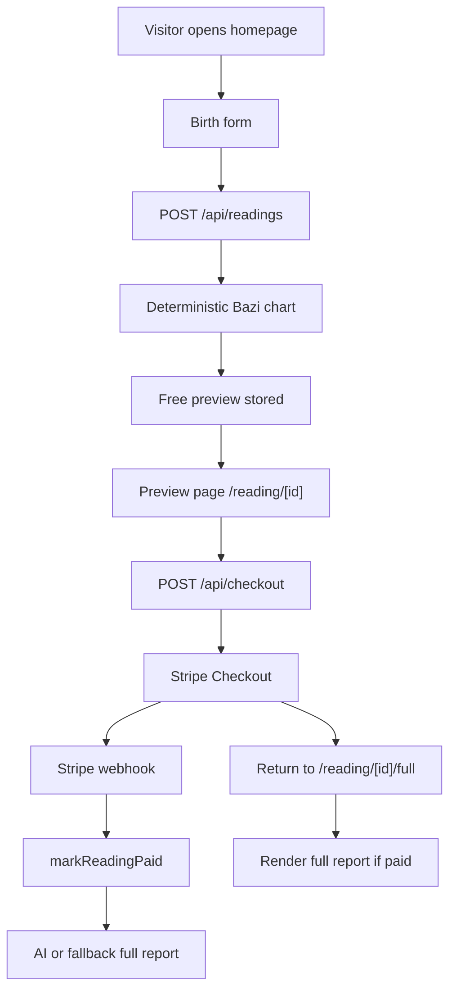

# Mingyi Architecture

## Current Architecture

Mingyi is a Next.js application deployed to Vercel. The app stores readings and payments in Supabase Postgres when `DATABASE_URL` is configured, with a local JSON store fallback for local development.

## Core Flow

## Boundaries

- `src/lib/bazi/chart.ts`: deterministic chart calculation and true solar time policy.
- `src/lib/reports/free-report.ts`: free preview generation.
- `src/lib/reports/ai-report.ts`: AI full-report generation through DeepSeek by default, OpenAI optionally.
- `src/lib/reports/full-report.ts`: deterministic fallback full report.
- `src/lib/db/readings.ts`: reading persistence, public/private reading shaping, payment marking, full-report storage.
- `src/lib/payments/stripe.ts`: Stripe Checkout and webhook verification.
- `src/lib/payments/webhook.ts`: Stripe event application.
- `src/components/*`: landing, form, preview, locked modules, and full report rendering.

## Access Model

- `getInternalReading` may return full data for server-side trusted code.
- `getReading` returns public data and strips `fullReport` unless `paymentStatus` is `paid`.
- Preview APIs and pages must not expose paid report content for unpaid readings.
- Stripe webhook is the trusted unlock path.

## P1 Architecture Direction

P1 should keep the current architecture and add small focused pieces:

- A report status surface for polling after payment.
- A client-side full-report waiting component.
- Structured visual report components based on `reading.chart`.
- Event logging helpers and tables for observability.
- Optional rate-limit helpers for preview and regeneration protection.
- SEO and sample-report pages as normal Next.js routes.

## Architecture Constraints

- Do not rewrite deterministic Bazi calculation unless fixing a clear bug.
- Do not change the 8-section full-report contract.
- Do not move secrets into frontend code.
- Do not add a normal-user payment bypass.
- Do not build admin dashboards, subscriptions, credits, or extra report payment flows in P1.
