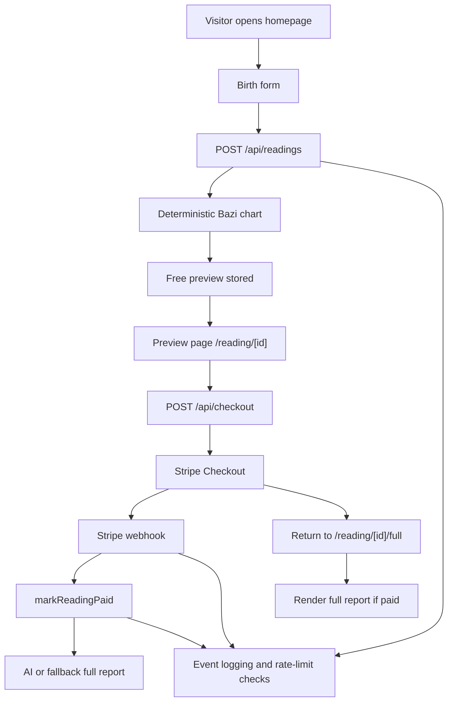
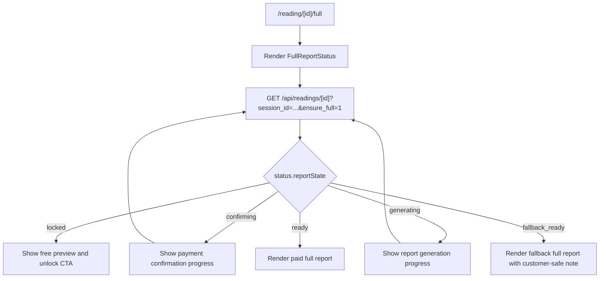
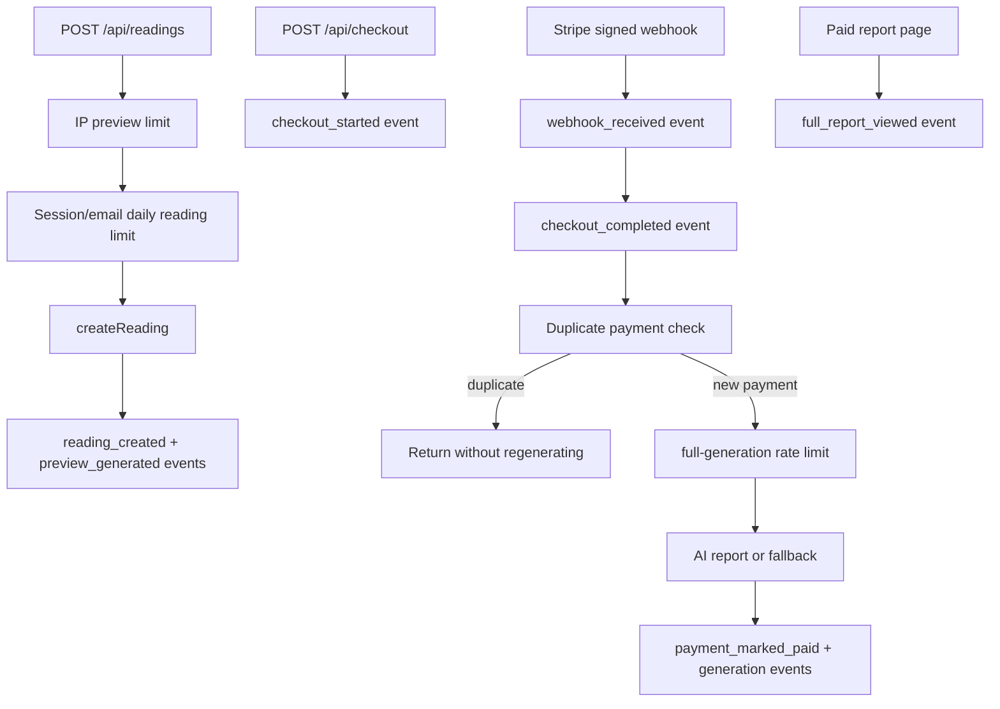

# Mingyi Architecture

## Current Architecture

Mingyi is a Next.js application deployed to Vercel. The app stores readings and payments in Supabase Postgres when `DATABASE_URL` is configured, with a local JSON store fallback for local development.

## Core Flow

## Boundaries

- `src/lib/bazi/chart.ts`: deterministic chart calculation and true solar time policy.
- `src/lib/reports/free-report.ts`: free preview generation.
- `src/lib/reports/ai-report.ts`: AI full-report generation through DeepSeek by default, OpenAI optionally.
- `src/lib/reports/full-report.ts`: deterministic fallback full report.
- `src/lib/db/readings.ts`: reading persistence, public/private reading shaping, payment marking, full-report storage.
- `src/lib/db/events.ts`: best-effort event logging to Supabase `app_events` or local JSON store.
- `src/lib/db/rate-limit.ts`: basic rate-limit counters backed by Supabase `app_rate_limits`, local JSON store, or in-memory fallback.
- `src/lib/payments/stripe.ts`: Stripe Checkout and webhook verification.
- `src/lib/payments/webhook.ts`: Stripe event application.
- `src/components/*`: landing, form, preview, locked modules, and full report rendering.

## Access Model

- `getInternalReading` may return full data for server-side trusted code.
- `getReading` returns public data and strips `fullReport` unless `paymentStatus` is `paid`.
- Preview APIs and pages must not expose paid report content for unpaid readings.
- Stripe webhook is the trusted unlock path.

## P1 Architecture Direction

P1 should keep the current architecture and add small focused pieces:

- A report status surface for polling after payment. P0.5 adds this to `GET /api/readings/[id]` as a `status` object.
- A client-side full-report waiting component. P0.5 adds `FullReportStatus` for `/reading/[id]/full`.
- Structured visual report components based on `reading.chart`.
- Event logging helpers and tables for observability.
- Optional rate-limit helpers for preview and regeneration protection.
- SEO and sample-report pages as normal Next.js routes. P1.1 adds `/sample-report` backed by static fake data in `src/lib/reports/sample-report.ts`.
- P1.2 adds paid-report visual evidence inside `src/components/FullReport.tsx`, using the existing `reading.chart` object and leaving the 8-section report prose contract intact.
- P1.3 extracts current 30-day energy fallback logic to `src/lib/reports/current-energy.ts` so the section can later become a standalone product without adding a payment path now.
- P1.5 centralizes contact/social/SEO page links in `src/lib/site-links.ts` and uses Next.js metadata, sitemap, and robots routes for basic public sharing.

## P0.5 Status Flow

The public status API strips internal fallback reasons from `fullReport.generation` before sending paid report data to the browser.

## P0.8 Stability Layer

Event logging is best effort: failures are caught so customer payment/report flows are not blocked by observability problems. Rate-limit storage prefers Supabase when configured, uses the local JSON store in development/tests, and falls back to in-memory counters if the database rate-limit table is temporarily unavailable.

## Architecture Constraints

- Do not rewrite deterministic Bazi calculation unless fixing a clear bug.
- Do not change the 8-section full-report contract.
- Do not move secrets into frontend code.
- Do not add a normal-user payment bypass.
- Do not build admin dashboards, subscriptions, credits, or extra report payment flows in P1.
